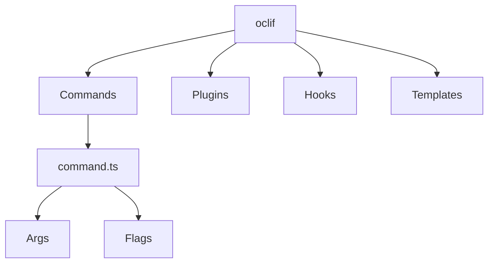

# 👋 Introduction

oclif is a framework for building command line tools using Node.js and Typescript. It provides structure, best practices, and helpers to speed up CLI development.

Some key features:

- Easy command organization
- Powerful command line argument parsing
- Help text generation
- Git-based plugins
- Testing helpers
- Reads from stdin and stdout

By using oclif we can speed up our CLI development process significantly.

## 🤖 How oclif Works

The core components of oclif include:



- **Commands** - Contains the logic for each command in a class. Stored in `src/commands`.
- **Args** - Defines the arguments passed to a command.
- **Flags** - Optional flags to modify command behavior.
- **Plugins** - Extend CLI functionality using Node.js modules.
- **Hooks** - Execute code before/after commands and other events.
- **Templates** - Quickly generate code for new components.

So oclif provides structure via commands, takes care of input parsing, allows extension via plugins, and makes it easy to add new features.

# 👩‍💻 Contributing Commands

To add a new command:

## 1. Generate Command

```
oclif generate command mycommand
```

This scaffolds a new command class in `src/commands/mycommand.ts`.

You can modify this command class by adding flags, keywords, descriptions, subcommands.

## 2. Implement Logic

- Add JSDoc comment description
- Define command arguments/flags
- Write the command logic in `run()` for each command
- Wherever possible use helper modules and functions
- Write helper modules in the `./src/utils` directory and import

## 3. Build and Test

```
npm run build
./bin/run mycommand
```

## 4. Update Docs

```
oclif readme
oclif docs
```

## 5. Open Pull Request

Submit PR with new command to merge into master.

# 🎉 Done!

Leveraging oclif makes CLI development straightforward and scalable. Thanks for contributing new features!

Let me know if you would like any additional sections covered.
