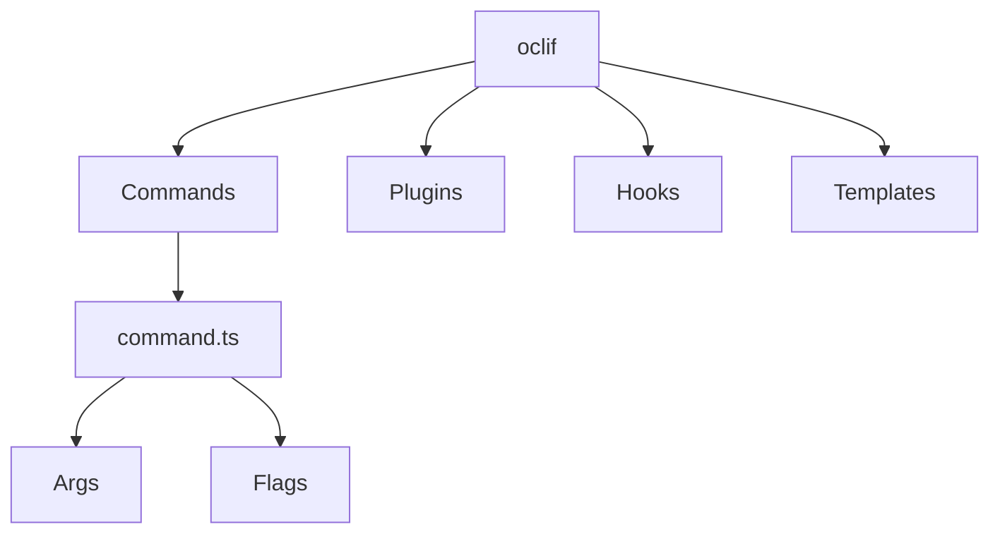

# 👋 Introduction

oclif is a framework for building command line tools using Node.js and Typescript. It provides structure, best practices, and helpers to speed up CLI development.

Some key features:

- Easy command organization
- Powerful command line argument parsing
- Help text generation
- Git-based plugins
- Testing helpers
- Reads from stdin and stdout

By using oclif we can speed up our CLI development process significantly.

## 🤖 How oclif Works

The core components of oclif include:



- **Commands** - Contains the logic for each command in a class. Stored in `src/commands`.
- **Args** - Defines the arguments passed to a command.
- **Flags** - Optional flags to modify command behavior.
- **Plugins** - Extend CLI functionality using Node.js modules.
- **Hooks** - Execute code before/after commands and other events.
- **Templates** - Quickly generate code for new components.

So oclif provides structure via commands, takes care of input parsing, allows extension via plugins, and makes it easy to add new features.

# 👩‍💻 Contributing Commands

To add a new command:

## 1. Generate Command

```
oclif generate command mycommand
```

This scaffolds a new command class in `src/commands/mycommand.ts`.

You can modify this command class by adding flags, keywords, descriptions, subcommands.

## 2. Implement Logic

- Add JSDoc comment description
- Define command arguments/flags
- Write the command logic in `run()` for each command
- Wherever possible use helper modules and functions
- Write helper modules in the `./src/utils` directory and import

Here is an example of a new module:

```typescript
/**
 * Search command to query data using a kind value.
 *
 * This allows searching OSDU data by specifying a kind
 * string to search for. It uses the SearchClient from
 * the osdu-workbench SDK to make the authorized API request.
 *
 * The results are displayed in a table using the cli-table module.
 */
export default class SearchKind extends Command {
  /**
   * Description shown in command list
   */
  static description = "Perform a search using a kind parameter";

  /**
   * Example commands
   */
  static examples = [
    `<%= config.bin %> <%= command.id %> osdu:wks:kind-string`,
  ];

  /**
   * Argument for search query
   */
  static args = {
    query: Args.string({
      description: "The kind query value to search for records",
    }),
  };

  /**
   * Handle command execution
   */
  async run() {
    /**
     * Parse CLI arguments
     */
    const { args } = this.parse(SearchKind);

    /**
     * OSDU search client
     */
    this.log(`Searching with parameter: kind and query: ${args.query}. `);

    // instantiate an instance of the search client
    const search = new Search.SearchClient(
      "https://osdu.osdupsdemo.install.osdu.aws",
      "us-east-1"
    );

    const q = args.query;

    if (!q) {
      this.error("No query supplied!");
    }

    const response = await search.query({
      kind: q,
    });

    displaySearchResults(response);
}
```

Here are some steps to generate and customize an oclif command with utils functions:

### Creating an Oclif Command

1. Generate a new command

   ```bash
   oclif command mycommand
   ```

   This will create the scaffolding in `./src/commands/mycommand.ts`

2. Modify the command description and examples in the class:

   ```ts
   static description = "My command description";

   static examples = [
     `mycommand example1`,
     `mycommand example2`
   ];
   ```

3. Add command arguments if needed:

   ```ts
   static args = {
     myArg: Args.string()
   };
   ```

4. Implement the `run()` method to execute the command logic.

### Adding Custom Utils Functions

1. Create a directory for the command utils functions.

   For a `mycommand` command, create `./src/utils/mycommand`.

2. Add utils files to match the command name:

   ```sh
   /utils
     /mycommand
       mycommand.utils.ts
   ```

3. Export functions from the utils file:

   ```ts
   // mycommand.utils.ts

   export function doSomething() {
     // ...
   }
   ```

4. Import and use the utils function in the command:

   ```ts
   import { doSomething } from '../utils/mycommand/mycommand.utils';

   async run() {
     doSomething();
   }
   ```

This allows keeping the command logic neatly organized with related utils functions.

### 3. Build and Test

```sh
npm run build
./bin/run mycommand
```

## 4. Update Docs

```sh
oclif readme
oclif docs
```

## 5. Open Pull Request

Submit PR with new command to merge into master.
